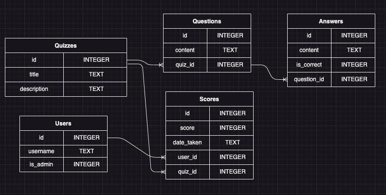
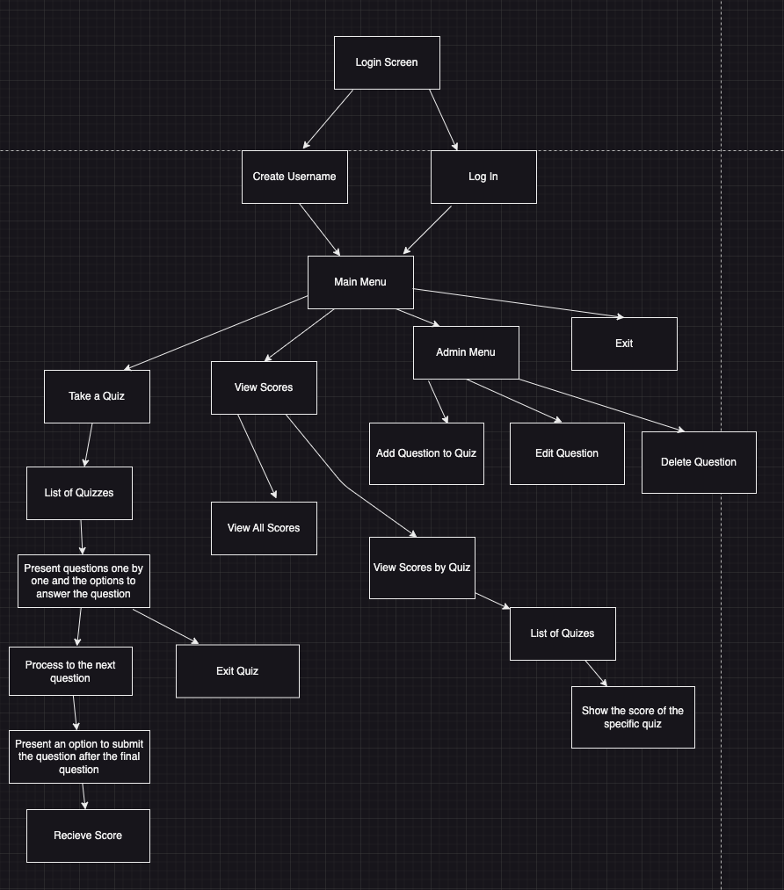
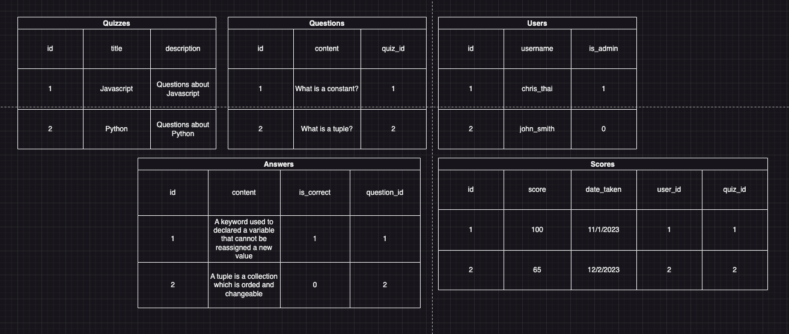

# QuizSphere

<!-- Headings -->

## Description

QuizSphere is a quiz application where users can choose a wide variety of quizzes covering various fields and topics.

## Database Diagram

## Constraints

- Users can have many scores, but each is associated only with one quiz.

- Each question should only have one correct answer.

## CRUD Actions

- Create

  - Create username
  - Create quiz
  - Create questions to quiz
  - Create list of answers to the questions
  - Create score have quiz is finished

- Read

  - List quizzes
  - List a question one at a time during the quiz
  - List the answer options to the questions
  - List all of the scores from all of the quizzes from the user
  - Find a score for a specific quiz
  - Admin user can see all usernames on the quiz application
  - Admin user can see all of the questions of a specific quiz
  - Admin user can see a specific username and they score to the quizzes

- Update

  - Update username
  - Update quiz
  - Update questions to quiz
  - Update answers to the questions
  - Update score

- Delete

  - Admin user can delete usernames
  - Admin user can delete the score of a specific username
  - Delete quiz
  - Delete questions to quiz
  - Delete answers to the questions

## Decision Tree

## Database

## Stretch Goals

1. Users will get specific images and songs when they pass or fail a quiz.

2. When users pass a certain amount of quizzes, they get granted access to more challenging quizzes.

3. More challenging quizzes will have timing elements, and users have to answer within a specific time limit.

## Trello Board

