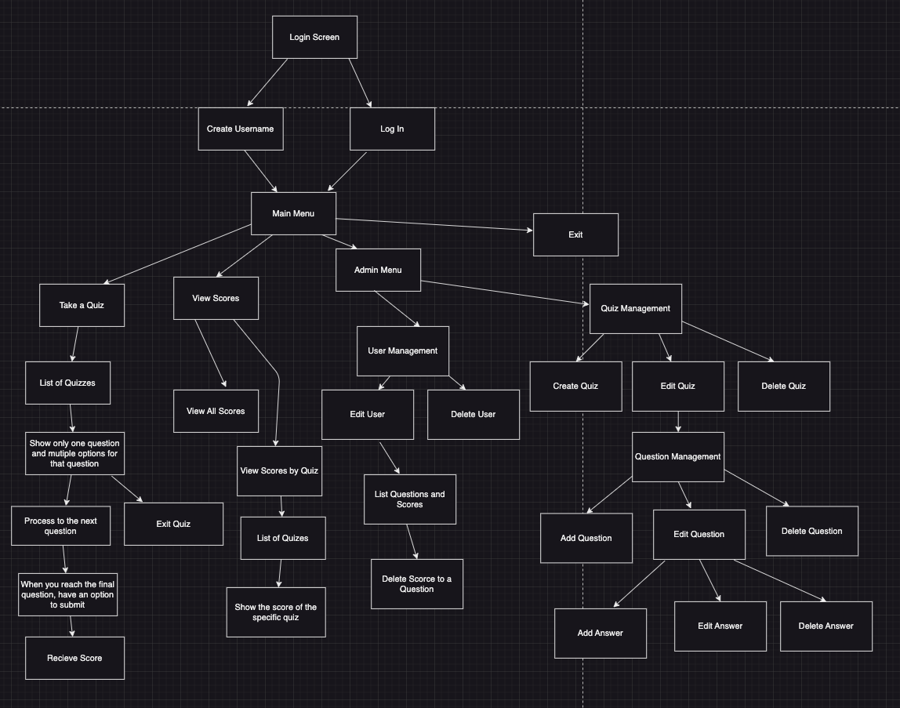

# QuizSphere

<!-- Headings -->

## Description

QuizSphere is a quiz application where users can choose a wide variety of quizzes covering various fields and topics.

## Database Diagram

## Constraints

- Users can have many scores, but each is associated only with one quiz.

- Each question should only have one correct answer.

## CRUD Actions

- Create

  - Create username
  - Create questions to quiz

- Read

  - List quizzes
  - List the answer options to the questions
  - List all of the scores from all of the quizzes from the user
  - Only view the score for a specific quiz

- Update

  - Update questions

- Delete

  - Delete questions

## Decision Tree

## Database

## Stretch Goals

1. Users can create new quizzes and topics.

2. Users will get specific images and songs when they pass or fail a quiz.

3. When users pass a certain amount of quizzes, they get granted access to more challenging quizzes.

## Trello Board

