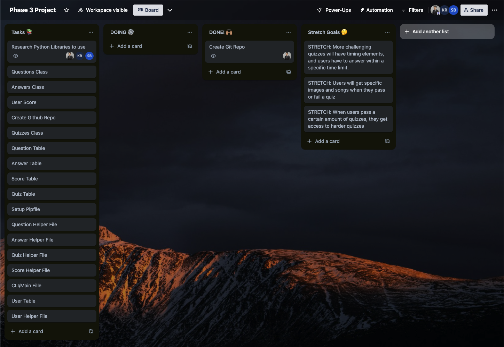

# QuizSphere

<!-- Headings -->

## Description

QuizSphere is a quiz application where users can choose a wide variety of quizzes covering various fields and topics.

## Prerequisites

Before you begin, ensure you have met the following requirements:

- You have installed [Git](https://git-scm.com/).
- You have a [GitHub](https://github.com/) account.
- You have installed [Python](https://www.python.org/) and [pipenv](https://pipenv.pypa.io/en/latest/).

## Getting Started

To get a local copy up and running, follow these steps.

### Back-end Installation

1. Ensure you are in the root directory of the project.

2. Install pipenv and dependencies:

   ```bash
   pipenv install
   ```

3. Activate the virtual environment:

   ```bash
   pipenv shell
   ```

## Running the Application

1. Navigate to the lib directory:

   ```bash
   cd lib
   ```

2. Start the application using the main script:

   ```bash
   python main.py
   ```

## Additional Notes

- Ensure your SQLite database file is correctly set up before starting the back-end server.

## Database Diagram


## Constraints

- Users can have many scores, but each is associated only with one quiz.

- Each question should only have one correct answer.

- All users should have an unique usernames.

- Admin users should only have the ability to edit quizzes and not take quizzes

## CRUD Actions

- Create

  - Create username
  - Create quiz
  - Create questions to quiz
  - Create list of answers to the questions
  - Create score once quiz is finished

- Read

  - List quizzes
  - List a question one at a time during the quiz
  - List the answer options to the questions
  - List all of the scores from all of the quizzes from the user
  - Find a score for a specific quiz
  - Admin user can see all usernames on the quiz application
  - Admin user can see all of the questions of a specific quiz
  - Admin user can see a specific username and they score to the quizzes

- Update

  - Update username
  - Update quiz
  - Update questions to quiz
  - Update answers to the questions
  - Update score

- Delete

  - Admin user can delete usernames
  - Admin user can delete the score of a specific username
  - Delete quiz
  - Delete questions to quiz
  - Delete answers to the questions

## Decision Tree


## Database


## Stretch Goals

1. Users will get specific images and songs when they pass or fail a quiz.

2. When users pass a certain amount of quizzes, they get granted access to more challenging quizzes.

3. More challenging quizzes will have timing elements, and users have to answer within a specific time limit.

## Trello Board


